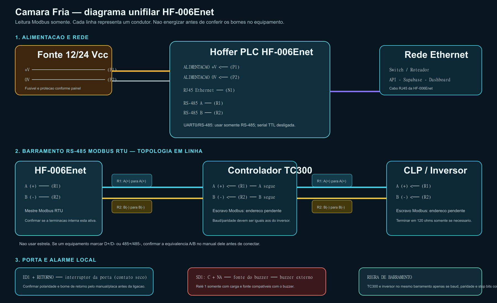

# Ligação de campo — HF-006Enet

## Sequência de montagem

1. Com tudo desligado, alimente a HF-006Enet com fonte 12 ou 24 Vcc, conforme o borne marcado na placa.
2. Ligue o cabo RJ45 da placa ao switch ou roteador.
3. Monte um único barramento RS-485: HF-006Enet -> TC300 -> CLP/inversor. Não use topologia em estrela.
4. Ligue A da placa ao A do TC300 e siga para A do inversor; repita B para B. Confirme a nomenclatura de cada equipamento antes de apertar os bornes.
5. Use o mesmo barramento somente se TC300 e inversor aceitarem a mesma configuração serial. Caso contrário, manteremos um segundo adaptador RS-485 isolado.
6. Ligue o interruptor da porta na ED1 e no borne de retorno correspondente.
7. Ligue o buzzer externo pela saída SD1, usando os contatos C e NA do relé e fonte compatível com a carga.

## Pendências de comissionamento

- Modelo, endereço Modbus, baud rate, paridade e stop bits do TC300.
- Modelo, endereço Modbus, baud rate, paridade e stop bits do CLP/inversor.
- Equivalência A/B ou D+/D- em ambos os equipamentos.
- Necessidade e posição da terminação de 120 ohms.
- Polaridade da ED1 e tensão/corrente do buzzer externo.